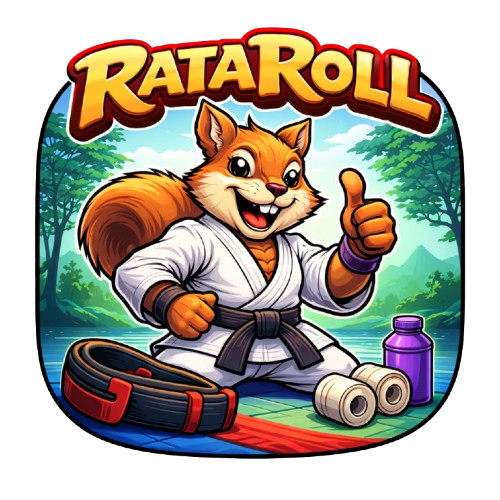

# 🥋 RataRoll


RataRoll is a React Native mobile application built with Expo.  
The app allows users to create and share Brazilian Jiu-Jitsu training posts, manage a profile, select avatars, search posts, and toggle dark mode.

Built as a personal project to strengthen Native development skills in React Native and TypeScript.

## Get started

 - Install dependencies

   ```bash
   npm install
   ```

 - Start app through terminal

   ```bash
    npx expo start
   ```

 - Scan QR-code presented in the terminal on your phone (NOTE! Must have installed Expo-app on device)
 - For web, press  
```bash
    w
   ```

 - Open app
  
## 🚀 Tech Stack

 -  **React Native with Expo**
    
-   **TypeScript**
    
-   **Expo Router**
    
-   **AsyncStorage**
    
-   **Git / GitHub**

## 📱 Features

-    📰 Dynamic feed with FlatList
    
-   🔍 Search functionality (filter by user name)
    
-   👤 Profile page with avatar selection (local + remote images)
    
-   🌙 Dark mode toggle (under construction)
    
-   💾 Local data persistence using AsyncStorage
    
-   🗂 Clean component-based architecture
    
-   🎯 Type-safe development with TypeScript


## 🧰 Prerequisites

-   **Node 18+**
    
-   **Yarn/PNPM/NPM**
    
-   **React Native CLI**  _or_  **Expo CLI**
    
-   **Xcode (macOS) for iOS, Android Studio for Android**

## 👨‍💻 **Author**
*Anders Bellsund Beil  
Frontend & Mobile Developer  
React Native | TypeScript | SwiftUI*
